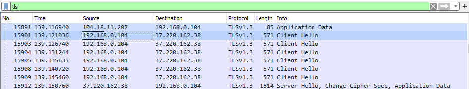

# SSH и утилиты  
**Secure Shell (SSH)** - зашифрованный сетевой протокол прикладного уровня, позволяющий производить удалённое управление операционной системой и туннелирование TCP-соединений.  
Подключиться к ssh-серверу: ssh userName@domainNameOrIpAddress [-p portNumber]  

Утилита **scp** работает по протоколу ssh; применяется для передачи файлов между клиентом и сервером.  
Выгрузить (upload) файл на сервер: scp pathToFileOnClient userName@domainNameOrIpAddress:pathToDirOnServer  
Скачать (download) файл с сервера: scp userName@domainNameOrIpAddress:pathToFileOnServer pathToDirOnClient  

**SSH port forwarding:** c помощью SSH туннелей можно пробросить порт с удалённого сервера на локальную машину.  
Сделаем удалённый сервер доступным локально на порте 8080 через ssh:  
ssh -L 8080:localhost:46090 userName@domainNameOrIpAddress  
Теперь можно из веб-браузера обращаться по адресу localhost:8080 к удаленному серверу на его порт 46090 (это будет работать, пока активна текущая ssh сессия).  

Чтобы каждый раз при подключении по SSH не вводить пароль, существует более удобный и безопасный **способ авторизации по ключам.** Для этого используются пары ключей (публичный-приватный) асимметричного алгоритма шифрования RSA.  
Сгенерировать новую пару ключей: ssh-keygen  
После генерации ключей необходимо скопировать содержимое файла с публичным ключом на сервер в файл ~/.ssh/authorized_keys.  

**Client url (curl)** - сетевая утилита, реализующая базовые возможности работы с URL страницами и передачу файлов; поддерживает большое количество протоколов (например, HTTP, HTTPS, FTP, POP3, IMAP, SMTP и прочие).  
Скачать содержимое файла по ссылке и сохранить в 1.txt: curl -o 1.txt https://sample/file.txt

Утилита **wget** похожа на curl, но поддерживает только протоколы HTTP, HTTPS и FTP. Преимущество wget перед curl заключается в том, что есть поддержка загрузки файлов по редиректам.  

## Задание 1

Загружаем файл с сервера:  

## Задание 2  
Скачиваем файл из Интернета на сервер и даем ему права:  

Пробрасываем порт и подключаемся к удаленному серверу через локальный порт:  

Загружаем файл на сервер:  

## Задание 3
Генерируем пару ключей:  

Копируем публичный ключ на сервер и подключаемся к серверу по ключу без ввода пароля:  

## Задание 4
Анализ трафика в Wireshark  
Фильтр: http  

Фильтр: tls  

  
В устаревших версиях протокола TLS адрес ресурса, к которому обращается пользователь, не шифровался, то есть злоумышленник мог его перехватить. Начиная с версии 1.3 (от 2018 г) адрес также передается в зашифрованном виде.  
Фильтр: dns  

## Задание 5

Смонтируем удаленную файловую систему с помощью sshfs:

На скриншоте выше виден процесс установки утилиты и монтирования удаленной файлловой системы в пользовательскую папку(слева), а справа открыта эта самая папка в файловом менеджере и видно, что в ней отображаются файлы с сервера.

Настроим ssh агента у себя:

Пароль передавать больше не нужно:

Wireshark с фильтром ssh:

Здесь видим, что перед началом работы у нас передаются запросы и подтверждения на установление сессии. Затем идет инициализация обмена ключами и затем уже мы видим непосредственно обмен пакетами зашифроваными.

